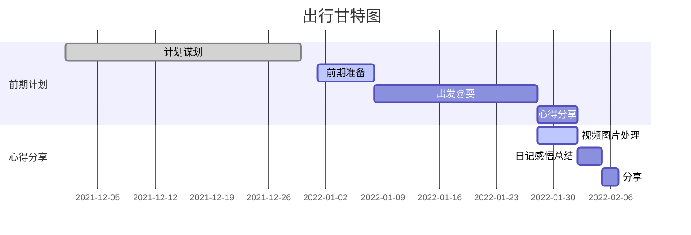

# 219国道

1. 219 国道是星空摄影师的天堂，也是我追逐日月星辰的首选。这条线路上，有许多极致的自然景观，如雪山、冰川、湖泊、森林、峡谷、沙漠等，巧妙地搭配地景与星空，就能拍出绝佳的星空摄影作品

2. 看看地图：http://www.oogps.com/baiduditu/

3.高速路况：https://gsgl.00cha.com/

```mermaid
%% 语法示例
        gantt
        dateFormat  YYYY-MM-DD
        title 出行甘特图
        
        section 前期计划
        计划谋划                      :done,    des1, 2021-12-01,2021-12-30
        前期准备                      :active,  des2, 2022-01-01, 7d
        出发@耍                        :        des3, after des2, 20d
        心得分享                           :        des4, after des3, 5d
        
        section 心得分享
        视频图片处理                              :active, a1, after des3, 5d
        日记感悟总结                               :after a1  , 3d
        分享                                            : 48h

```
 

### by  fcy